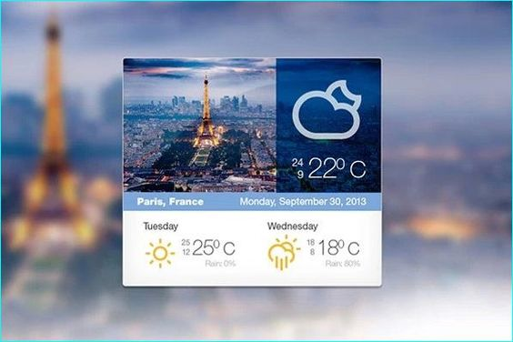
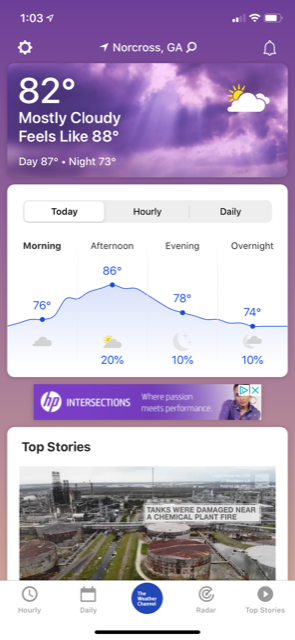

# WEATHERLY

This app uses a [Vercel](https://vercel.com/) integration.  
Find it live at [Weatherly](https://weatherly-2.vercel.app/)

This project was bootstrapped with [Create React App](https://github.com/facebook/create-react-app).

This app design was inspired by

and

## Running Weatherly:

### You will need to.

1. Clone the project.

- https - `git clone https://github.com/rahmor/weatherly-2.git`
- ssh - `git@github.com:rahmor/weatherly-2.git`

2. Install the dependencies.

- `npm install`

3. Get an api key from [Open Weather](https://openweathermap.org/)

- Add to .env file

4. Get an api key from [Open Cage Geolocation](https://opencagedata.com/)

- Add to .env file

In the project directory, you can run:

### `npm start`

Runs the app in the development mode. 
Open [http://localhost:3000](http://localhost:3000) to view it in the browser.

The page will reload if you make edits. 
You will also see any lint errors in the console.

## Testing Weatherly

### `npm run test`

Launches the test runner in the interactive watch mode. 
See the section about [running tests](https://facebook.github.io/create-react-app/docs/running-tests) for more information.

### `npm run build`

Builds the app for production to the `build` folder. 
It correctly bundles React in production mode and optimizes the build for the best performance.

The build is minified and the filenames include the hashes. 
Your app is ready to be deployed!

See the section about [deployment](https://facebook.github.io/create-react-app/docs/deployment) for more information.
